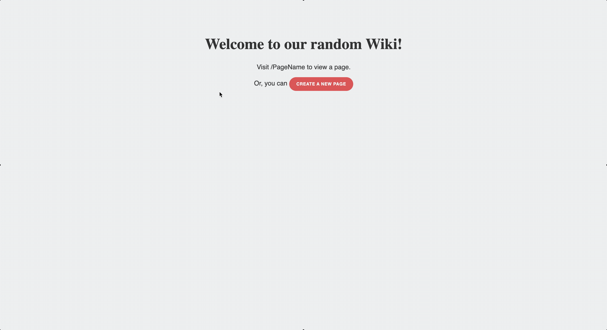
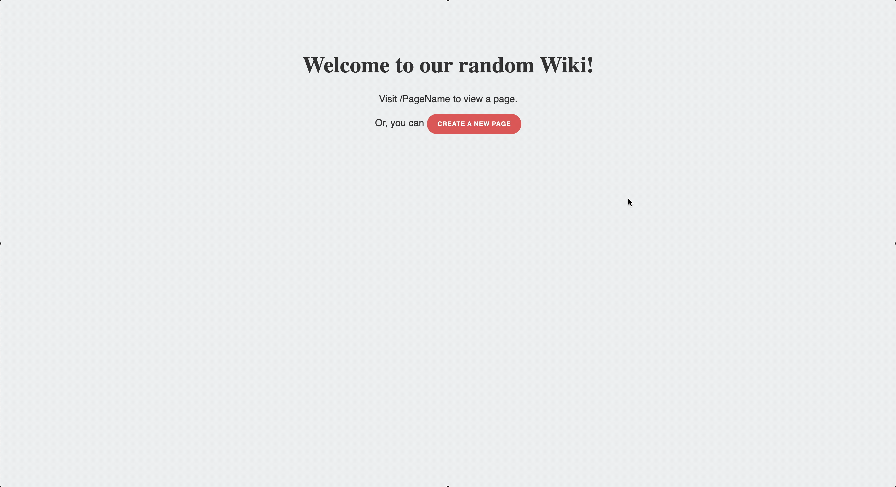
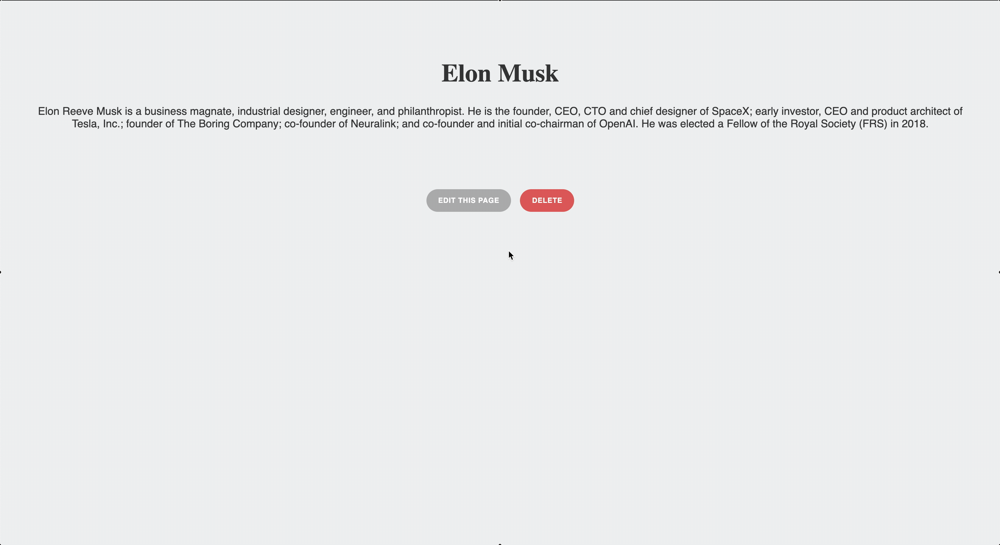
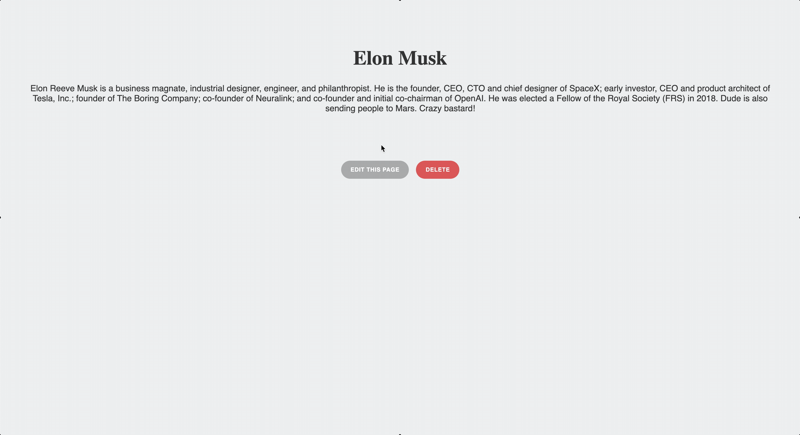

# Sinatra-Wiki

Small and very primitive Wiki built using the Sinatra webframework

Final project in the "Learn Ruby" track on TeamTreehouse.com. The Goal was to create a simple Wiki page to learn CRUD operations and routing using the Sinatra framework. This project was not meant for a deep dive. It is just a small intro into webdevelopment with Sinatra.

### Things learned in the course:

* Importing and using Sinatra
* Routing requests
* Simple CRUD operations using files instead of a database
* HTML templating using .erb files
* Serving static files through the public folder

To test the app run the following command in your terminal:

```
ruby wiki.rb
```
After running the command you can access the website from http://localhost:4567/

*Notice: You might want to add a pages folder in the root directory in case you get an error message when creating wiki pages*

## Demo

### Accessing existing page



### Creating a new wiki page



### Edit a wiki page



### Deleting a wiki page



## Beyond the initial project

The basic project did not include any sort of 404 page in case a requested wiki page did not exist. It would simply use the path variable and show a wiki page entry without any content and the path variable as title. 
I added a simple if else to the *get "/:title"* route to check if the *page_content* method returned the content or nil. In case of nil(file did not exist) the route would redirect the user to a new page seen in the delete demo gif. The page loads a new erb tamplate that I created and it informs the user that the page does not exist but that he can create it following the link.

### Further development possibilities 

I thought of what could be added in the future to make this a more robust project. 

- add a search field instead of searching manually in the address bar.
- connect to a real database
- a better front page with cards showing existing entries (could also be used to display search results)
- better editor for formating page content
- better content formating in general
- enable images on wiki pages
- add user accounts and authentication

I have no intention of implementing these additions but they would possibly make the project something you could actually deploy into production. 
